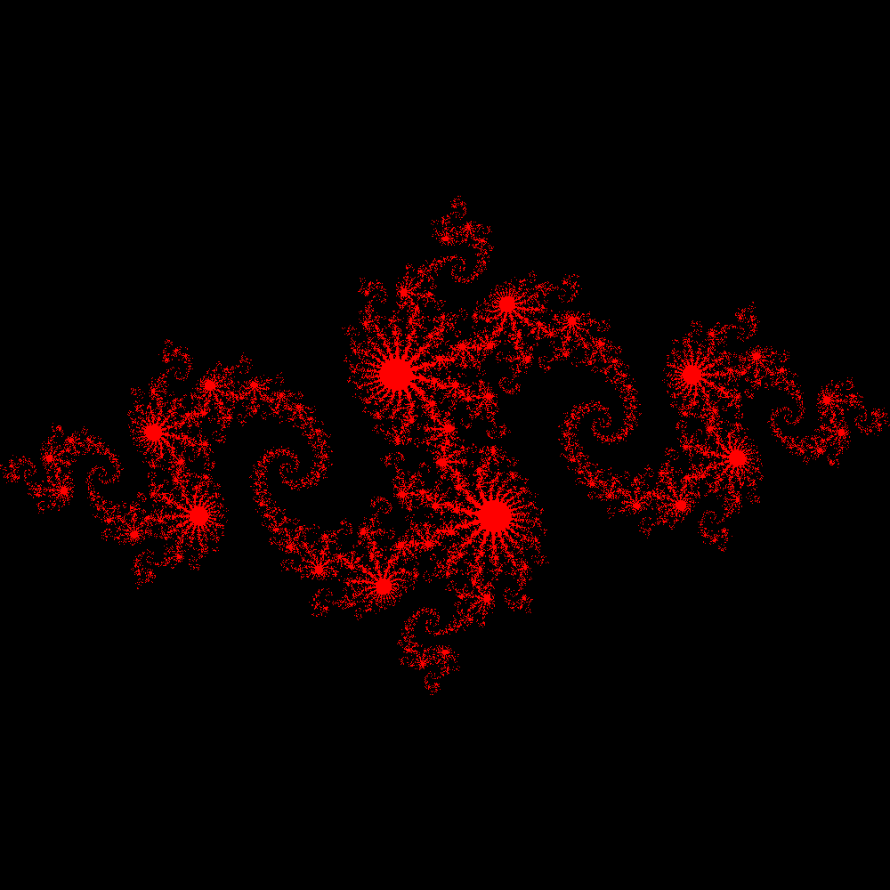

# CUDA-code-snippets
A collection of CUDA codes in CUDA C++

The codes are based on the code snippets from the book "CUDA By Example" by Sanders and Kandrot. The main difference is that I have tried to use the CUDA library "Thrust", as much as possible, in order to avoid boilerplate code.

To compile, simply enter the code folder, open a terminal there, and run:

`nvcc sourceFile.cu -o targetFile.exe -std=c++17`

Since the Thrust library in CUDA 13.0 needs the C++17 standard, a suitable C++ compiler is also necessary (amongst other things).

Here's an image of the Julia Set from one of the codes:

